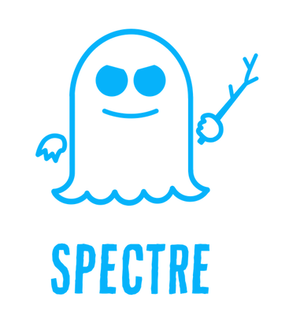

# Spectre attack



Spectre breaks the isolation between different applications. It allows an attacker to trick error-free programs, which follow best practices, into leaking their secrets. In fact, the safety checks of said best practices actually increase the attack surface and may make applications more susceptible to Spectre.

# Compile

Just run `make` to compile the source code.

# Run

```
taskset -c 1 ./exploit
```

# Authors

Spectre was independently discovered and reported by two people:

 * Jann Horn (Google Project Zero).
 * Paul Kocher in collaboration with, in alphabetical order, Daniel Genkin (University of Pennsylvania and University of Maryland), Mike Hamburg (Rambus), Moritz Lipp (Graz University of Technology), and Yuval Yarom (University of Adelaide and Data61).

# References

 * [Original Paper - Spectre Attacks: Exploiting Speculative Execution](https://spectreattack.com/spectre.pdf)
 * [The Intel 80x86 Processor Architecture: Pitfalls for Secure Systems](https://pdfs.semanticscholar.org/2209/42809262c17b6631c0f6536c91aaf7756857.pdf)
